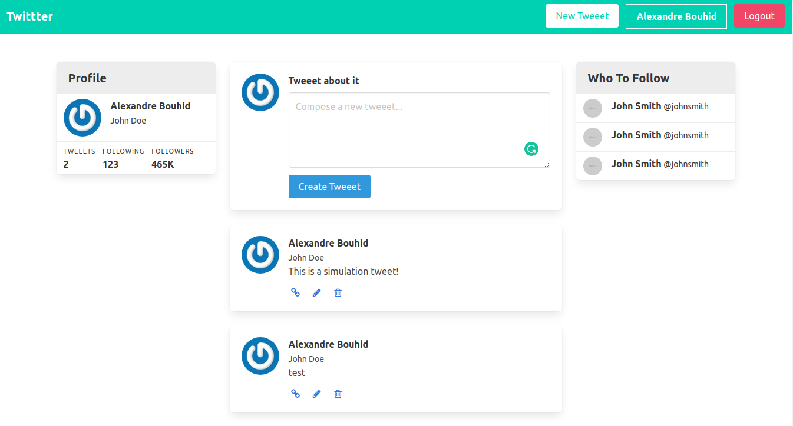

# Twitter Clone Project
 This project consists on creating a Twitter-like project using Ruby on Rails. In the server it is possible to:
 - Create accounts;
 - Create tweets;
 - Log in/out;
 - Sign in/Sign up;



## Built With

- Ruby on Rails version 6.0


### Prerequisites

- Browser (Google Chrome, Mozilla Firefox, Safari or any other browser)
- Ruby and Ruby on Rails installed in your machine
- SQLite installed in your machine

### Ruby gems used in this build

- [Better Errors](https://rubygems.org/gems/better_errors) - For better errors

- [Bulma](https://github.com/joshuajansen/bulma-rails) - for easy CSS. Feel free to roll your own styles and/or use a different framework.

- [Guard](https://github.com/guard/guard) - Useful for live reloading our `scss`, `js`, `css`, and `erb` files, although it's capable of much more!

  *Guard is required for the Guard LiveReload gem to work*

- [Guard LiveReload](https://github.com/guard/guard-livereload)

- [Simple Form](https://github.com/plataformatec/simple_form) - For simple forms!

- [Devise](https://github.com/plataformatec/devise) - Effortless user roles and authentication

- [Gravatar_image_tag](https://github.com/mdeering/gravatar_image_tag) - Integrated image tag which spits out gravatars.


### Getting Started
```
Open Terminal
run git clone git@github.com: git@github.com:abouhid/Twitter_clone.git
run cd Twittter
run yarn install --check-files (if asked)
run rake db:migrate
run rails s
open http://localhost:3000 in your browser
```
- In the browser you are able create tweets, create an account, log in and log out

## Authors

👤 **Alexandre Bouhid**

- Github: [@abouhid](https://github.com/abouhid)
- LinkedIn: [Alexandre Bouhid](https://www.linkedin.com/in/alexandrebouhid/)


## 🤝 Contributing

Contributions, issues and feature requests are welcome!

Feel free to check the [issues page](https://github.com/KelynPNjeri/re-former/issues).

## Show your support

Give a ⭐️ if you like this project!

## Acknowledgments

- Microverse
- GitHub
- TheOdinProject
- Ruby

## 📝 License

This project is [MIT](lic.url) licensed.
